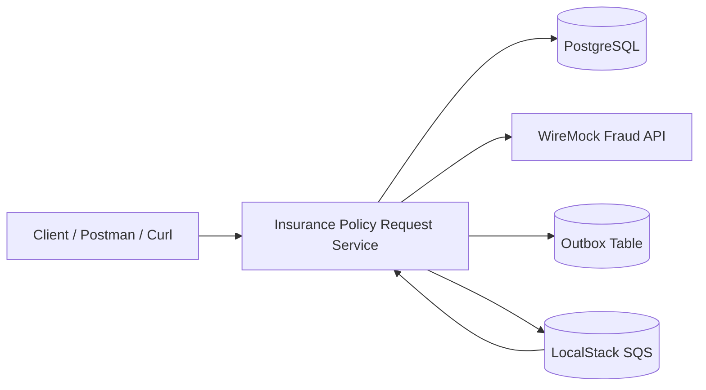
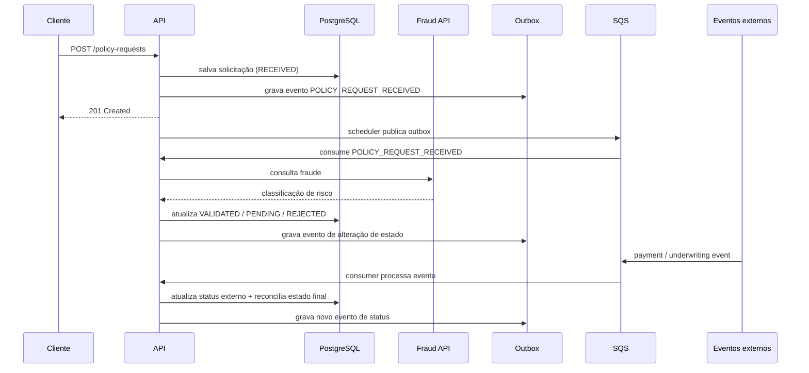
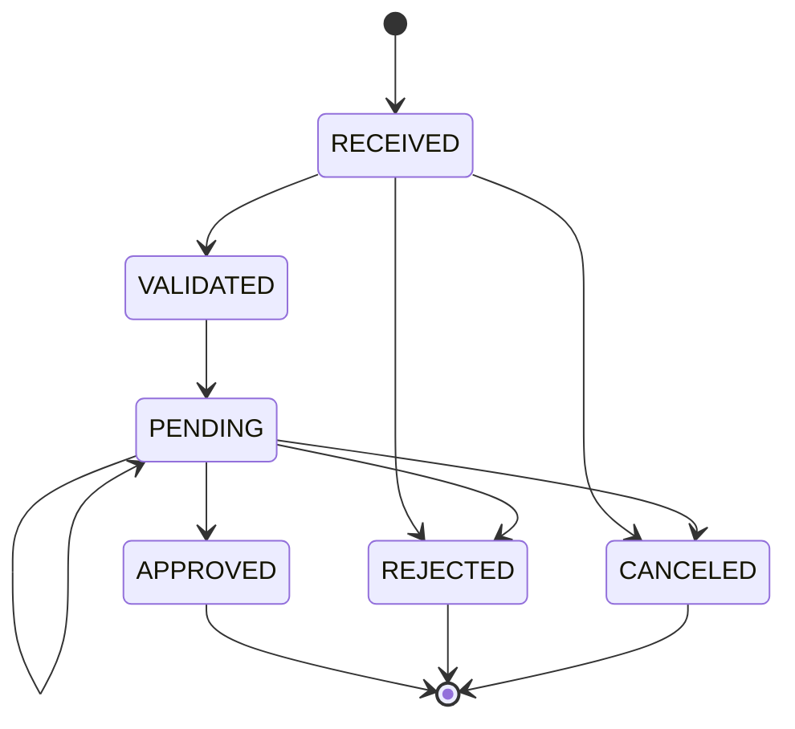
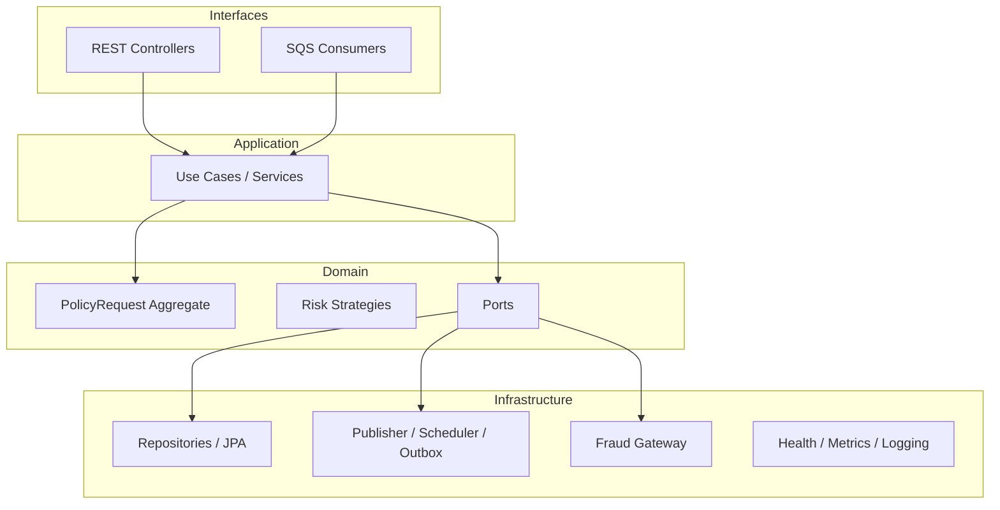

# Insurance Policy Request Service

Microsserviço orientado a eventos para gerenciamento do ciclo de vida de solicitações de apólice de seguros.

## 1. Visão geral

Este projeto implementa o serviço de **solicitações de apólice** do desafio da seguradora ACME. A solução recebe solicitações via API REST, persiste os dados em PostgreSQL, consulta uma API de fraude mockada para classificação de risco, aplica regras de validação conforme o perfil do cliente, processa eventos externos de pagamento e subscrição, permite cancelamento quando aplicável e publica eventos a cada alteração de estado.

A solução foi construída com foco em:

- Clean Architecture
- Event-Driven Architecture
- baixo acoplamento entre domínio e infraestrutura
- observabilidade
- testes de unidade e integração
- consistência entre persistência e publicação de eventos via outbox

---

## 2. Escopo da solução

A solução implementa os seguintes comportamentos principais:

- recebimento de solicitações de apólice via REST
- persistência em banco de dados
- consulta por `requestId` e `customerId`
- integração com API de fraude via mock server
- processamento de eventos de pagamento e subscrição
- cancelamento de solicitações
- transições de estado conforme ciclo de vida
- publicação de eventos de mudança de estado
- observabilidade com healthchecks, métricas e logs
- testes automatizados com Mockito e Testcontainers

---

## 3. Arquitetura da solução

### 3.1 Estilo arquitetural

A solução adota uma combinação de:

- **Clean Architecture**
- **DDD tático leve**
- **EDA (Event-Driven Architecture)**

Estrutura principal de pacotes:

- `domain`: regras de negócio, estados, estratégias, portas
- `application`: casos de uso / serviços de aplicação
- `infrastructure`: persistência, mensageria, observabilidade, integração externa
- `interfaces`: controllers REST e consumers SQS

### 3.2 Diagrama de componentes



### 3.3 Fluxo principal



### 3.4 Máquina de estados



### 3.5 Estrutura por camadas



---

## 4. Decisões arquiteturais

### 4.1 REST para entrada e consulta
A entrada principal do domínio é uma API REST para criação, consulta e cancelamento.

### 4.2 Mensageria para fluxos assíncronos
Pagamento, subscrição, análise assíncrona e publicação de mudanças de estado são tratados via filas SQS (LocalStack em ambiente local).

### 4.3 Outbox Pattern
Toda alteração relevante de estado gera um registro em outbox. Um scheduler publica os eventos pendentes. Isso reduz o risco de inconsistência entre banco e mensageria.

### 4.4 Idempotência
Eventos externos de pagamento e subscrição são protegidos por uma tabela de mensagens processadas, evitando reprocessamento por `eventId`.

### 4.5 Strategy Pattern
As regras de validação por classificação de risco foram isoladas em estratégias (`REGULAR`, `HIGH_RISK`, `PREFERRED`, `NO_INFORMATION`).

### 4.6 Aggregate rico
O aggregate `PolicyRequest` centraliza transições de estado, histórico e reconciliação de status assíncronos.

### 4.7 WireMock para fraude
A API de fraude não foi implementada como serviço real. O comportamento foi simulado com WireMock, conforme orientação do desafio.

---

## 5. Premissas adotadas

- O escopo do projeto cobre **somente** o serviço de solicitações de apólice.
- A emissão da apólice foi representada pelo estado final `APPROVED`.
- O mock da fraude foi dirigido por `customerId`, facilitando cenários determinísticos em testes manuais.
- O campo principal de validação das regras de risco é o `insuredAmount`.
- Solicitações em estado `APPROVED` ou `REJECTED` não podem mais ser canceladas.
- Mensagens externas usam JSON.
- Para testes manuais no Windows, o envio para o SQS foi documentado usando `docker cp` + `file://`, evitando problemas de escaping no terminal.
- Os campos persistidos foram mantidos compatíveis com o escopo funcional do desafio.
- O serviço publica eventos de alteração de estado para permitir notificação e encadeamento com outros serviços do ecossistema.

---

## 6. Tecnologias utilizadas

- Java 17
- Spring Boot
- Spring Web
- Spring Data JPA
- Flyway
- PostgreSQL
- Spring Cloud AWS SQS
- LocalStack
- WireMock
- Micrometer
- Prometheus Registry
- JUnit 5
- Mockito
- Testcontainers

---

## 7. Como executar o projeto

### 7.1 Pré-requisitos

- JDK 17
- Maven
- Docker Desktop
- PowerShell ou terminal compatível
- Curl, Postman ou Insomnia

### 7.2 Subir infraestrutura local

```cmd
docker compose up -d postgres localstack wiremock
```

### 7.3 Criar filas no LocalStack

```cmd
docker exec insurance-localstack awslocal sqs create-queue --queue-name payment-processed-queue
docker exec insurance-localstack awslocal sqs create-queue --queue-name underwriting-processed-queue
docker exec insurance-localstack awslocal sqs create-queue --queue-name policy-request-received-queue
docker exec insurance-localstack awslocal sqs create-queue --queue-name policy-status-changed-queue
```

Opcional: listar filas

```cmd
docker exec insurance-localstack awslocal sqs list-queues
```

### 7.4 Subir a aplicação

```cmd
.\mvnw.cmd spring-boot:run -Dspring-boot.run.profiles=local
```

### 7.5 Smoke test inicial

```cmd
curl http://localhost:8080/actuator/health
curl http://localhost:8080/actuator/metrics
```

## 8. Collections Postman

Para facilitar a validação da solução, o repositório também inclui collections do Postman com os principais fluxos funcionais e de observabilidade.

### Collections disponíveis

- `postman/insurance-policy-request-service.postman_collection.json`  
  Collection principal com os fluxos funcionais da API, incluindo criação de solicitação, consulta por id, consulta por customerId, cancelamento e cenários de validação do fluxo principal.

- `postman/insurance-observability.postman_collection.json`  
  Collection dedicada à observabilidade, com requests para healthchecks, métricas customizadas e endpoint Prometheus.

### Observação

As collections foram adicionadas ao repositório para tornar a execução e a validação mais simples para quem estiver executando a solução.

---

## 9. Infraestrutura local

O `docker-compose.yml` sobe os seguintes componentes:

- **postgres**: persistência do serviço
- **localstack**: broker local com SQS
- **wiremock**: mock server da API de fraude
- **app**: aplicação Spring Boot

---

## 10. Ciclo de vida da solicitação

Estados suportados:

- `RECEIVED`
- `VALIDATED`
- `PENDING`
- `APPROVED`
- `REJECTED`
- `CANCELED`

Resumo do fluxo:

1. criação via REST -> `RECEIVED`
2. processamento assíncrono da fraude
3. se aprovado nas regras -> `VALIDATED` e depois `PENDING`
4. se reprovado nas regras -> `REJECTED`
5. se pagamento e subscrição aprovarem -> `APPROVED`
6. se pagamento ou subscrição negarem -> `REJECTED`
7. cancelamento permitido até o encerramento final

---

## 11. Regras por classificação de risco

### Cliente Regular (REGULAR)
- vida ou residencial: até R$ 500.000,00
- auto: até R$ 350.000,00
- demais categorias: até R$ 255.000,00

### Cliente Alto Risco (HIGH_RISK)
- auto: até R$ 250.000,00
- residencial: até R$ 150.000,00
- demais categorias: até R$ 125.000,00

### Cliente Preferencial (PREFERRED)
- vida: menor que R$ 800.000,00
- auto e residencial: menor que R$ 450.000,00
- demais categorias: até R$ 375.000,00

### Cliente Sem Informação (NO_INFORMATION)
- vida ou residencial: até R$ 200.000,00
- auto: até R$ 75.000,00
- demais categorias: até R$ 55.000,00

---

## 12. Endpoints REST

### 12.1 Criar solicitação

`POST /policy-requests`

Exemplo:

```bash
curl --request POST   --url http://localhost:8080/policy-requests   --header 'Content-Type: application/json'   --data '{
    "customerId": "22222222-2222-2222-2222-222222222222",
    "productId": 123,
    "category": "AUTO",
    "salesChannel": "MOBILE",
    "paymentMethod": "CREDIT_CARD",
    "totalMonthlyPremiumAmount": 75.25,
    "insuredAmount": 200000.00,
    "coverages": {
      "Roubo": 100000.00,
      "Perda Total": 100000.00
    },
    "assistances": ["Guincho 24h", "Chaveiro"]
  }'
```

Resposta esperada:

```json
{
  "id": "xxxxxxxx-xxxx-xxxx-xxxx-xxxxxxxxxxxx",
  "status": "RECEIVED",
  "createdAt": "2026-03-15T03:47:04.934248Z"
}
```

### 12.2 Consultar por id

`GET /policy-requests/{requestId}`

```bash
curl http://localhost:8080/policy-requests/{requestId}
```

### 12.3 Consultar por customerId

`GET /policy-requests?customerId={customerId}`

```bash
curl "http://localhost:8080/policy-requests?customerId=22222222-2222-2222-2222-222222222222"
```

### 12.4 Cancelar solicitação

`POST /policy-requests/{requestId}/cancel`

```bash
curl --request POST http://localhost:8080/policy-requests/{requestId}/cancel
```

---

## 13. Integração com fraude

A classificação de risco é simulada pelo WireMock.

Exemplos de cenários usados:

- `22222222-2222-2222-2222-222222222222` -> `REGULAR`
- `33333333-3333-3333-3333-333333333333` -> `HIGH_RISK`
- `44444444-4444-4444-4444-444444444444` -> `PREFERRED`
- `55555555-5555-5555-5555-555555555555` -> `NO_INFORMATION`

Teste direto do mock:

```bash
curl "http://localhost:8089/fraud-analysis/test-id?customerId=33333333-3333-3333-3333-333333333333"
```

---

## 14. Mensageria e eventos

### 14.1 Filas utilizadas

- `payment-processed-queue`
- `underwriting-processed-queue`
- `policy-request-received-queue`
- `policy-status-changed-queue`

### 14.2 Método escolhido para testes manuais

Para reproduzir os testes de mensageria de forma confiável no Windows, os payloads foram salvos em arquivos `.json` e enviados com:

1. `docker cp` para dentro do container do LocalStack
2. `awslocal sqs send-message --message-body file:///...`

### 14.3 Exemplo de payload de pagamento aprovado

Arquivo `manual-tests/payment-approved.json`:

```json
{
  "eventId": "33333333-3333-3333-3333-333333333333",
  "requestId": "REQUEST_ID",
  "status": "APPROVED",
  "occurredAt": "2026-03-15T04:20:00Z"
}
```

Envio:

```bash
docker cp ./manual-tests/payment-approved.json insurance-localstack:/tmp/payment-approved.json
docker exec insurance-localstack awslocal sqs send-message   --queue-url http://localhost:4566/000000000000/payment-processed-queue   --message-body file:///tmp/payment-approved.json
```

### 14.4 Exemplo de payload de pagamento negado

```json
{
  "eventId": "55555555-5555-5555-5555-555555555555",
  "requestId": "REQUEST_ID",
  "status": "DENIED",
  "occurredAt": "2026-03-15T04:40:00Z"
}
```

### 14.5 Exemplo de payload de subscrição aprovada

```json
{
  "eventId": "44444444-4444-4444-4444-444444444444",
  "requestId": "REQUEST_ID",
  "status": "APPROVED",
  "occurredAt": "2026-03-15T04:21:00Z"
}
```

Envio:

```bash
docker cp ./manual-tests/underwriting-approved.json insurance-localstack:/tmp/underwriting-approved.json
docker exec insurance-localstack awslocal sqs send-message   --queue-url http://localhost:4566/000000000000/underwriting-processed-queue   --message-body file:///tmp/underwriting-approved.json
```

### 14.6 Exemplo de payload de subscrição negada

```json
{
  "eventId": "66666666-6666-6666-6666-666666666666",
  "requestId": "REQUEST_ID",
  "status": "DENIED",
  "occurredAt": "2026-03-15T04:45:00Z"
}
```

### 14.7 Fluxos testados manualmente

- REGULAR -> `PENDING`
- HIGH_RISK acima do limite -> `REJECTED`
- pagamento `DENIED` -> `REJECTED`
- subscrição `DENIED` -> `REJECTED`
- pagamento `APPROVED` + subscrição `APPROVED` -> `APPROVED`
- idempotência por `eventId`
- cancelamento -> `CANCELED`

---

## 15. Observabilidade

### 15.1 Healthchecks

```bash
curl http://localhost:8080/actuator/health
curl http://localhost:8080/actuator/health/outbox
curl http://localhost:8080/actuator/health/sqsQueues
```

### 15.2 Métricas

```bash
curl http://localhost:8080/actuator/metrics
curl http://localhost:8080/actuator/metrics/insurance.outbox.pending
curl http://localhost:8080/actuator/metrics/insurance.outbox.failed
curl http://localhost:8080/actuator/prometheus
```

### 15.3 Logs

A aplicação adiciona `X-Correlation-Id` em cada request/resposta HTTP e propaga esse identificador para os logs usando MDC.

Exemplo:

```bash
curl -i http://localhost:8080/actuator/health -H "X-Correlation-Id: demo-123"
```

---

## 16. Testes

### 16.1 Unitários
- máquina de estados
- estratégias de risco
- casos de uso
- consumers
- outbox factory
- scheduler
- publisher
- tratamento de erro
- health indicators
- parser de eventos SQS

### 16.2 Integração
- persistência com PostgreSQL via Testcontainers
- repositórios principais
- outbox
- mensagens processadas

### 16.3 Execução

Todos os testes:

```cmd
.\mvnw.cmd test
```

Exemplos específicos:

```cmd
.\mvnw.cmd -Dtest=PolicyRequestRepositoryIT test
.\mvnw.cmd -Dtest=OutboxEventRepositoryIT test
.\mvnw.cmd -Dtest=ProcessedMessageRepositoryIT test
.\mvnw.cmd -Dtest=GlobalExceptionHandlerTest test
```

---

## 17. Validação dos fluxos

Esta seção resume o roteiro mínimo para validar os principais comportamentos da solução após subir a infraestrutura e a aplicação.

### 17.1. Fluxo REGULAR até `PENDING`

Criar uma solicitação com `customerId` mapeado para cenário `REGULAR` no WireMock:

```bash
curl --request POST \
  --url http://localhost:8080/policy-requests \
  --header 'Content-Type: application/json' \
  --data '{
    "customerId": "22222222-2222-2222-2222-222222222222",
    "productId": 123,
    "category": "AUTO",
    "salesChannel": "MOBILE",
    "paymentMethod": "CREDIT_CARD",
    "totalMonthlyPremiumAmount": 75.25,
    "insuredAmount": 200000.00,
    "coverages": {
      "Roubo": 100000.00,
      "Perda Total": 100000.00
    },
    "assistances": ["Guincho 24h", "Chaveiro"]
  }'
```

Consultar por id após alguns segundos:

```bash
curl http://localhost:8080/policy-requests/{requestId}
```

Resultado esperado:
- criação retorna `RECEIVED`
- após o processamento assíncrono da fraude, a solicitação evolui para `PENDING`

---

### 17.2. Fluxo HIGH_RISK até `REJECTED`

Criar uma solicitação com `customerId` mapeado para `HIGH_RISK` e valor acima do limite aceito:

```bash
curl --request POST \
  --url http://localhost:8080/policy-requests \
  --header 'Content-Type: application/json' \
  --data '{
    "customerId": "33333333-3333-3333-3333-333333333333",
    "productId": 123,
    "category": "AUTO",
    "salesChannel": "MOBILE",
    "paymentMethod": "CREDIT_CARD",
    "totalMonthlyPremiumAmount": 75.25,
    "insuredAmount": 260000.00,
    "coverages": {
      "Roubo": 130000.00,
      "Perda Total": 130000.00
    },
    "assistances": ["Guincho 24h"]
  }'
```

Consultar por id:

```bash
curl http://localhost:8080/policy-requests/{requestId}
```

Resultado esperado:
- a solicitação deve terminar em `REJECTED`

---

### 17.3. Fluxo de aprovação com pagamento + subscrição

Pré-condição:
- criar uma solicitação REGULAR
- aguardar até que ela esteja em `PENDING`

#### 17.3.1 Pagamento aprovado

Arquivo `payment-approved.json`:

```json
{
  "eventId": "33333333-3333-3333-3333-333333333333",
  "requestId": "REQUEST_ID",
  "status": "APPROVED",
  "occurredAt": "2026-03-15T04:20:00Z"
}
```

Envio:

```bash
docker cp .\manual-tests\payment-approved.json insurance-localstack:/tmp/payment-approved.json
docker exec insurance-localstack awslocal sqs send-message --queue-url http://localhost:4566/000000000000/payment-processed-queue --message-body file:///tmp/payment-approved.json
```

#### 17.3.2 Subscrição aprovada

Arquivo `underwriting-approved.json`:

```json
{
  "eventId": "44444444-4444-4444-4444-444444444444",
  "requestId": "REQUEST_ID",
  "status": "APPROVED",
  "occurredAt": "2026-03-15T04:21:00Z"
}
```

Envio:

```bash
docker cp ./manual-tests/underwriting-approved.json insurance-localstack:/tmp/underwriting-approved.json
docker exec insurance-localstack awslocal sqs send-message --queue-url http://localhost:4566/000000000000/underwriting-processed-queue --message-body file:///tmp/underwriting-approved.json
```

Consultar por id:

```bash
curl http://localhost:8080/policy-requests/{requestId}
```

Resultado esperado:
- após os dois eventos aprovados, a solicitação deve ficar em `APPROVED`

---

### 17.4. Fluxo de cancelamento

Criar uma nova solicitação e cancelar antes da aprovação final:

```bash
curl --request POST http://localhost:8080/policy-requests/{requestId}/cancel
```

Consultar por id:

```bash
curl http://localhost:8080/policy-requests/{requestId}
```

Resultado esperado:
- a solicitação deve ficar em `CANCELED`

---

### 17.5. Healthchecks e métricas

#### Health geral

```bash
curl http://localhost:8080/actuator/health
```

#### Health do outbox

```bash
curl http://localhost:8080/actuator/health/outbox
```

#### Health das filas SQS

```bash
curl http://localhost:8080/actuator/health/sqsQueues
```

#### Métricas expostas

```bash
curl http://localhost:8080/actuator/metrics
curl http://localhost:8080/actuator/metrics/insurance.outbox.pending
curl http://localhost:8080/actuator/metrics/insurance.outbox.failed
curl http://localhost:8080/actuator/prometheus
```

Resultado esperado:
- health geral em `UP`
- `outbox` e `sqsQueues` em `UP`
- métricas customizadas do outbox disponíveis no actuator

---

## 18. Melhorias futuras

- tracing distribuído
- dashboards Grafana/Prometheus
- autenticação e autorização
- CI/CD
- API versioning

---

## 19. Conclusão

A solução foi construída com foco em clareza arquitetural, testabilidade, observabilidade e reprodutibilidade. O projeto entrega o fluxo de ponta a ponta do serviço de solicitações de apólice, cobrindo criação, validação por fraude, processamento assíncrono, cancelamento, publicação de eventos e documentação de execução e demonstração.
